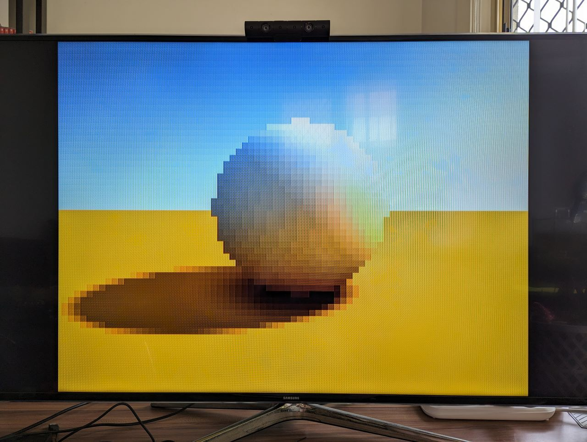
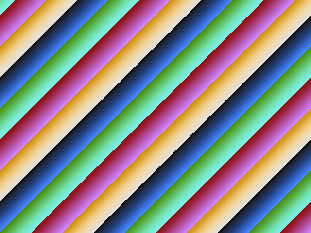
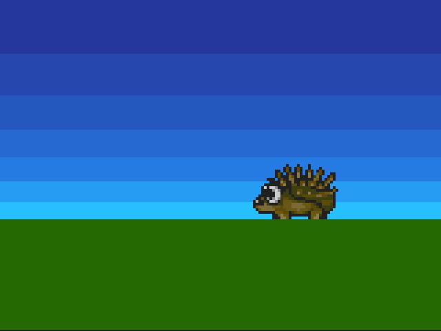
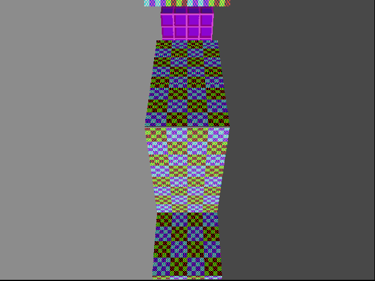
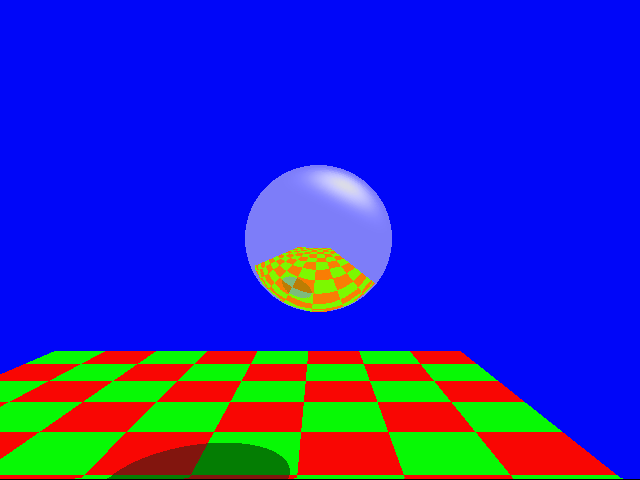
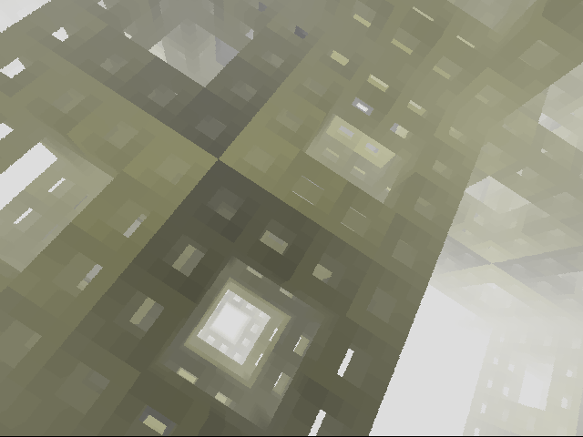
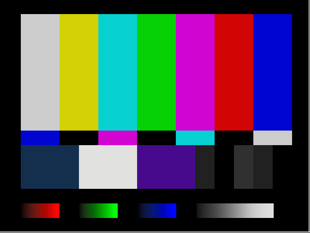
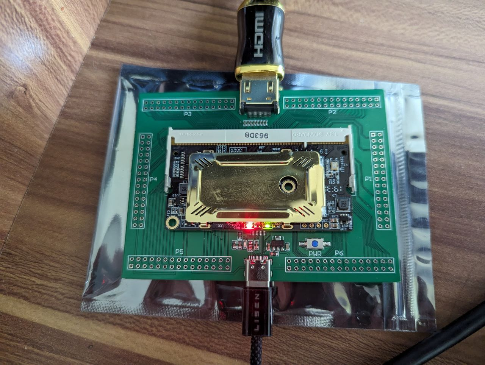

# fpgatoy

This is a simple framework for running Shadertoy-style "shaders" on an FPGA, synthesised directly as a logic circuit without any CPU or GPU.
It operates by ["racing the beam"](https://tomverbeure.github.io/rtl/2018/11/26/Racing-the-Beam-Ray-Tracer.html),
generating pixel values just in time to be sent out in the HDMI signal, without any intermediate framebuffer.



  
  

## Hardware

I'm using a Colorlight i9, with [Muse Lab's development board](https://tomverbeure.github.io/2021/01/22/The-Colorlight-i5-as-FPGA-development-board.html).
This is the best value FPGA board I've found — it provides 45k LUTs (almost double the 25k LUTs in the i5 version) and can be purchased for less than 50 USD.



However, thanks the the abstractions provided by [LiteX-Boards](https://github.com/litex-hub/litex-boards), it should be trivial to port to any of the other 100+ supported FPGA platforms.

One thing to keep in mind is that the clock reset generators (CRGs) provided by `litex_boards.targets` don't follow a consistent abstraction,
with most of them hardcoding the HDMI video clocks for a specific resolution and framerate.
I've [patched](https://github.com/davidar/litex-boards/commit/6acd4fe39d7435a99625aedee195cffe4427d781) the `colorlight_i5` target to expose the pixel clock frequency.

## Software

- [OSS CAD Suite](https://github.com/YosysHQ/oss-cad-suite-build)
- [LiteX](https://github.com/enjoy-digital/litex)
- remember to [setup udev rules](https://github.com/adamgreig/ecpdap/tree/master/drivers)

If using WSL2:
- [usbipd](https://github.com/dorssel/usbipd-win)
- [kernel with `CONFIG_USB_HIDDEV` enabled](https://github.com/microsoft/WSL2-Linux-Kernel/releases/tag/linux-msft-wsl-5.15.150.1)

To build and load a simple example shader, just run `./example.py`

Most of the examples run in simulation by default, but you can run them on the FPGA by
commenting out the `@fpgatoy.SimSoC` line and uncommenting `@fpgatoy.MySoC`.
This is the class that you'll need to modify to support different hardware,
for the colorlight it looks like this:

```py
class MySoC(BaseSoC):
    def __init__(self, main_image):
        self._sys_clk_freq = int(25e6)
        self._platform = colorlight_i5.Platform("i9", "7.2")
        self.crg = colorlight_i5_CRG(
            self._platform, self._sys_clk_freq, with_video_pll=True, pix_clk=25e6
        )
        BaseSoC.__init__(self, main_image, "hdmi")
```
